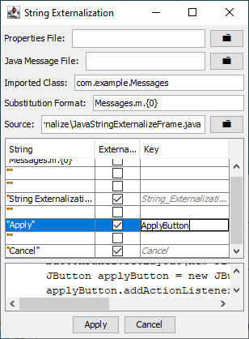

# JavaStringExternalize

A basic internationalization tool to externalize strings in Java source files so that they can be translated. It's heavily inspired by Eclipse's Externalize Strings tool, but I want to externalize my strings in a specific way since I'm transcompiling to JavaScript using GWT, so I've written my own tool so that I could customize the output myself. The code is written specifically to handle my desired way to access external strings, which is fairly unique, so you will need to change the code to output a more standard format




## Externed strings format

Since I designed the tool because I wanted to externalize my strings in a special way, I will describe that format here. But the code should be easy to modify to output things in a different format.

Similar to Eclipse-style externed strings, by default, the program will change your strings to be accessed through fields/variables of a class. Since externed strings actually appear as Java code, it's possible to statically analyze the use of externed strings. The names of these fields will be based on the original string contents.

Here is an example:

```
  System.out.println("hello world")
```

becomes

```
  System.out.println(Messages.m.hello_world);  
```

where `Messages` has a format similar to this:

```
class Messages {
  static Messages m = ...;

  // One field for each externed string. These fields
  // will be read in from properties files of 
  // translated strings
  //
  public String hello_world;
  ...
  
}
```

When externalizing strings in this way, you need to specify the name of the class that will hold your externed strings. You do this by setting two configuration options. The first is the "imported class" in the UI. An import statement will be added to the source file to import that class. The second is the "substitution format" in the UI. Simply adjust the substitution (in MessageFormat format) with the class name that holds your messages. You can also change it to use a completely different externed string scheme.

The properties file where the externalized strings are stored is just a normal Java .properties file for storing translations. The program will not create the .properties file. You should create one manually (it's just a blank text file), and then set the configuration to point to the file. New externed strings will be added to the end of the .properties file. The program does not check for repeats.

Similarly, the program will not create the class used to hold the fields for accessing the messages. You should create that yourself, then configure the program with the location of the Java file of that class, and the program will add new externed strings to the end of the class.

If your class is called `Messages`, then the Java file of that class will look like this:

```
package com.example;

public class Messages
{
  // Loads the translations from messages.properties
  // and other messages_en.properties, 
  // messages_fr.properties, etc. files
  // that are stored in the com/example directory.
  public static Messages m =
    MessagesReader.loadMessages(
      new Messages(), 
      "com.example.messages");

  // New externalized strings will be added here
  ...  
}

```

with a corresponding class for actually reading those messages with this format:

```
public class MessagesReader
{
  public static <U> U loadMessages(U messages, String name)
  {
    ResourceBundle bundle = 
      PropertyResourceBundle.getBundle(name, 
        Locale.getDefault(), 
        messages.getClass().getClassLoader());
    for (String key: bundle.keySet())
    {
      try {
        Field f = messages.getClass().getField(key);
        f.set(messages, bundle.getString(key));
      }
      catch (Exception e)
      {
        e.printStackTrace();
      }
    }
    return messages;
  }
}
```


## Command-line options

You may have to run the program multiple times to externalize the strings of multiple source files. Instead of needing to reconfigure the settings of the program each time, a lot of the configuration options can be set from the command-line. Just run the program with the "-help" command-line argument to get a list of command-line configuration options.